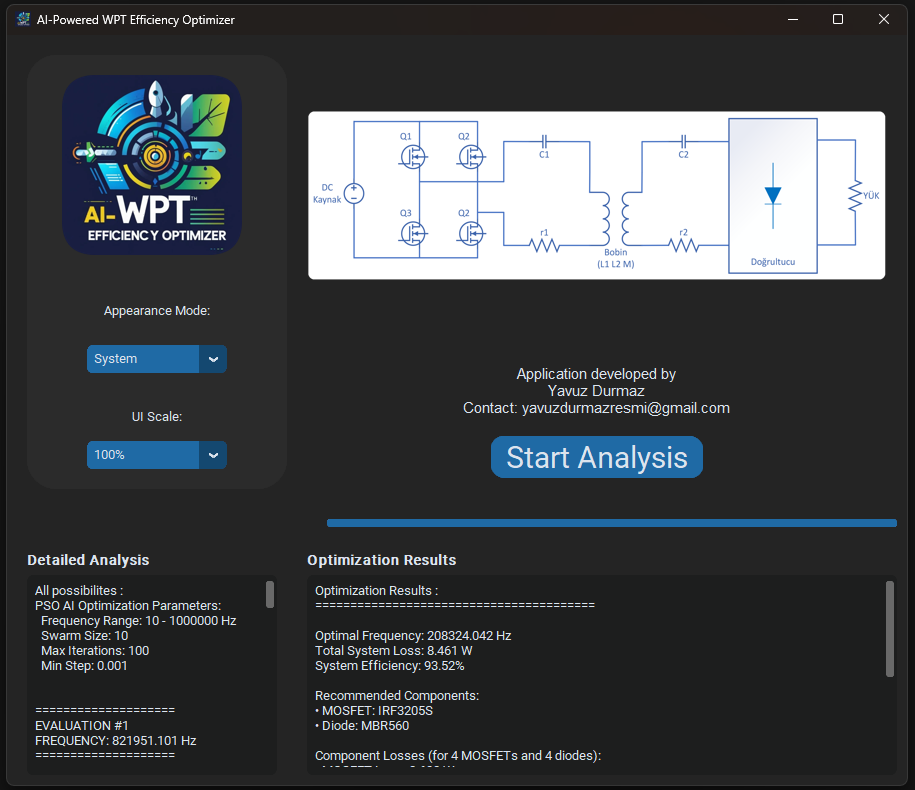

# AI-Powered WPT (Wireless Power Transmission) Efficiency Optimizer

This Python project employs an AI-driven Particle Swarm Optimization (PSO) algorithm to identify the most efficient combination of MOSFETs, diodes, and operating frequencies for Wireless Power Transfer (WPT) systems. By analyzing comprehensive electrical and cost parameters of each component, the algorithm achieves an optimal balance between minimizing power losses and ensuring cost-effectiveness. This detailed, data-driven approach enables highly precise optimization, resulting in superior system efficiency under real-world constraints.



## Features

- **AI Optimization**: Utilizes PSO to intelligently select system parameters for maximum efficiency.
- **Component Selection**: Searches through MOSFET and diode databases to find the best candidates.
- **User Interface**: Provides a desktop GUI built with `customtkinter` for ease of use.
- **Detailed Results**: Displays comprehensive optimization results, including coil parameters and loss analysis.
- **Progress Tracking**: Includes progress bars and detailed analysis logs during optimization.

## Installation

1. Clone the repository:
   ```bash
   git clone https://github.com/yavuz-durmaz/AI-Powered_WPT_Efficiency_Optimizer.git
   cd AI-Powered_WPT_Efficiency_Optimizer
   ```

2. Install dependencies (ensure Python 3.8+):
   ```bash
   pip install -r requirements.txt
   ```

## Usage

Follow these steps to use the application effectively:

1. **Update the Component Databases (Optional)**  
   You may update the MOSFET (`mosfet_database.xlsx`) and DIODE (`diode_database.xlsx`) database files with new components and specifications.

2. **Configure System & Optimization Parameters (Optional)**  
   Open the `input_values.xlsx` file.  
   Set or adjust the following parameters:

   - **System Parameters:**  
     - Coupling Coefficient  
     - Number of Turns (Primary)  
     - Wire Thickness (Primary)  
     - Space Between Wires (Primary)  
     - Outer Radius (Primary)  
     - Number of Turns (Secondary)  
     - Wire Thickness (Secondary)  
     - Space Between Wires (Secondary)  
     - Outer Radius (Secondary)  
     - Load  
     - Number of Mosfets  
     - Number of Diodes  
     - Mosfet RMS Current  
     - Mosfet Voltage  
     - Mosfet Average Current  
     - Coil Current  
     - Diode RMS Current  
     - Diode Average Current  
     - Secondary Voltage  
     - Unit Resistance of the Primary Coil  
     - Unit Resistance of the Secondary Coil  
     - Lower Frequency Limit (Hz)  
     - Upper Frequency Limit (Hz)

   - **PSO Algorithm Parameters:**  
     - Number of Particles in Swarm  
     - Maximum Iterations  
     - Minimum Step Size for Convergence

3. **Launch the Application**  
   You can either:  
   - Run the Windows batch file:
     ```bash
     main.bat
     ```
   - Or directly run the Python script:
     ```bash
     python main.py
     ```

4. **Start the Optimization**  
   Once the GUI loads, press the **Start Analysis** button.  
   The optimization process will begin, and live logs will appear on the bottom left of the screen.

5. **View the Results**  
   After completion, all results — including optimized frequency, component selections, coil parameters, and power loss analysis — will be displayed on the main screen.
   
## Project Structure

- `main.py`: Entry point of the application.
- `main_app.py`: Main GUI logic and workflow.
- `optimization_engine.py`: Core optimization logic using PSO.
- `data_loader.py`: Loads system/component data.
- `ui_components.py`: GUI component definitions.
- `data_models.py`: Data models for system and results.
- `main.bat`: Windows batch script for easy execution.

## License

This project is licensed under the MIT License. See the [LICENSE](LICENSE) file for details.

## Author

[Yavuz Durmaz](https://github.com/yavuz-durmaz)
